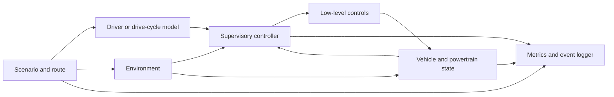
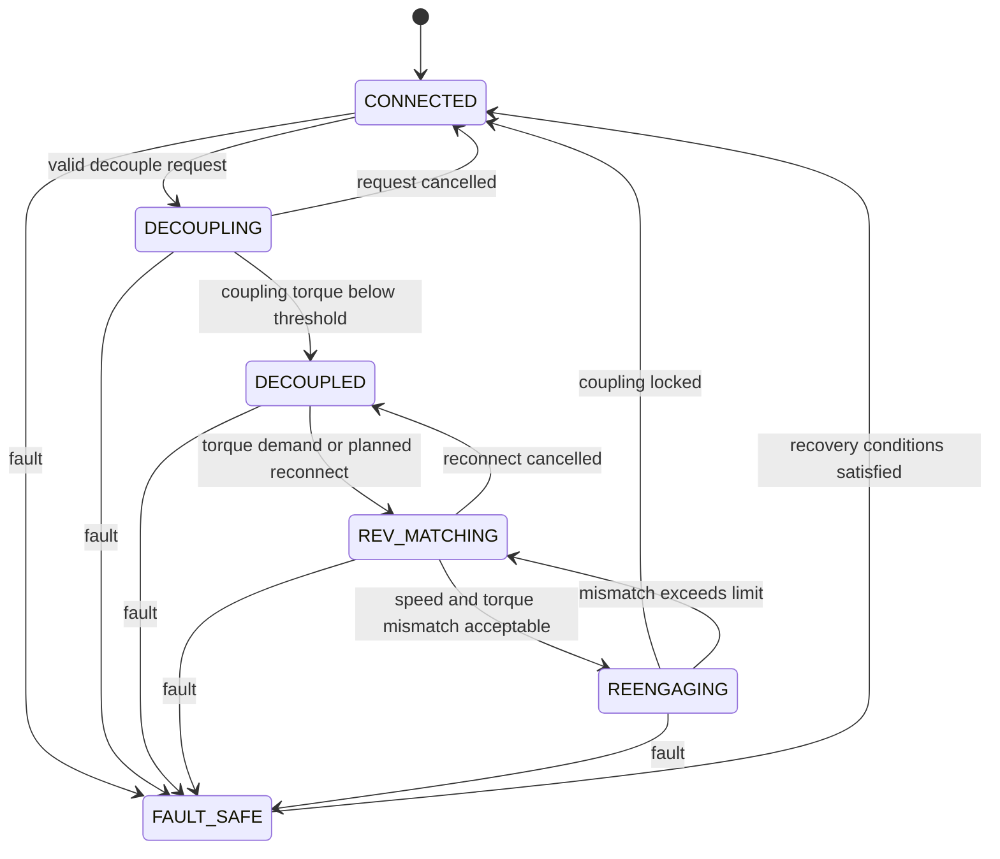

# System Architecture

## 1. Architectural Goals

The ADDS architecture must support fair controller comparison, replaceable model
fidelity, deterministic testing, and clear separation between physical dynamics
and decision logic.

The same simulation plant should be used for the conventional and ADDS vehicles.
Only controller authority and policy should differ unless an experiment
explicitly declares a hardware change.

## 2. System Context



The simulator advances in discrete time while representing continuous physical
states. The supervisory controller runs at a defined control interval, which may
be slower than the plant integration interval.

## 3. Major Components

### 3.1 Experiment Orchestrator

Responsibilities:

- Load and validate experiment configuration.
- Construct vehicle, environment, controller, and scenario instances.
- Set deterministic random seeds.
- Run one or more simulations.
- Store metadata, trajectories, events, and summary metrics.
- Prevent comparison of incompatible configurations without an explicit flag.

### 3.2 Scenario Manager

The scenario manager supplies:

- Target speed or driver command.
- Road grade and optional curvature.
- Speed limits and route preview.
- Wind and environmental conditions.
- Disturbance events.
- Initial state and termination conditions.

A scenario is immutable during a comparison run except for declared stochastic
signals generated from a recorded seed.

### 3.3 Driver Model

The driver model converts desired motion into accelerator and brake demand. It
may be:

- A direct drive-cycle tracker.
- A deterministic feedback controller.
- A recorded human input trace.
- A stochastic driver model for robustness studies.

Driver behavior must be shared by both vehicle variants or controlled carefully
to avoid confounding the comparison.

### 3.4 Supervisory Controller

The supervisory controller decides:

- Whether connection should be maintained.
- Whether decoupling should begin.
- When rev-matching should begin.
- Which gear should be targeted for re-engagement.
- When coupling closure is allowed.
- Whether a fallback state is required.

Controller implementations should share one interface:

```text
observation + preview + controller memory
    -> requested mode + target gear + bounded control references
```

Candidate implementations include conventional logic, rule-based ADDS,
model-predictive control, offline oracle optimization, and machine learning.

### 3.5 Safety and Transition Supervisor

Policy output is a request, not direct actuator authority. The safety supervisor:

- Validates requested transitions.
- Applies action masks and operating limits.
- Enforces minimum dwell times.
- Rejects impossible gear or engine-speed targets.
- Limits torque and coupling commands.
- Selects a deterministic fallback after invalid data or repeated violations.

This component must remain independent of the learned policy.

### 3.6 Low-Level Controllers

Low-level controllers convert supervisory references into actuator commands:

- Engine torque and idle-speed control.
- Rev-matching speed control.
- Coupling capacity or clutch pressure control.
- Gear selection and shift sequencing.
- Foundation brake command.

Initial low-level controllers should be deterministic and shared across
supervisory strategies.

### 3.7 Physical Plant

The plant is composed of replaceable submodels:

- Engine and fuel consumption.
- Engine rotational dynamics.
- Coupling or clutch.
- Transmission and final drive.
- Wheel and tire longitudinal dynamics.
- Vehicle longitudinal motion.
- Resistive forces and road grade.
- Optional actuator delay, thermal state, and component-loss models.

Each submodel must declare states, inputs, outputs, parameters, units, and valid
operating ranges.

### 3.8 Observation Builder

The observation builder exposes only signals available to the selected
experimental assumption. It is responsible for:

- Sampling and filtering plant signals.
- Applying sensor delay, noise, and quantization when enabled.
- Constructing route-preview features.
- Normalizing ML observations without changing physical logs.
- Preventing accidental access to future information.

Perfect-state and realistic-observation experiments must be labeled separately.

### 3.9 Metrics and Event Logger

The logging system records:

- Time-series states, commands, forces, powers, and energy flows.
- Mode transitions and their causes.
- Constraint interventions.
- Re-engagement quality.
- Scenario and configuration identifiers.
- Controller version and model artifact hash.

Metric calculation should occur from logged physical signals rather than
controller self-reports.

## 4. Drivetrain State Machine



Transition guards should include vehicle speed, engine-speed feasibility,
braking demand, tire-force margin, coupling thermal state, actuator health,
minimum dwell time, and route-specific restrictions.

## 5. Core Data Contracts

### Simulation State

At minimum:

- Simulation time.
- Vehicle position, speed, and acceleration.
- Wheel speed.
- Engine speed and engine state.
- Selected and target gear.
- Coupling state, slip speed, and transmitted torque.
- Fuel consumed and cumulative energy terms.
- Current operating mode and mode duration.

### Controller Observation

At minimum:

- Current measurable state.
- Driver accelerator and brake demand.
- Target speed and tracking error.
- Road grade and configured preview features.
- Available gear and torque limits.
- Transition history and controller timers.

### Controller Action

At minimum:

- Requested operating mode.
- Requested target gear.
- Engine torque or target-speed reference during transition.
- Coupling torque-capacity reference.
- Optional confidence or fallback request.

### Step Result

At minimum:

- Next state.
- Applied actuator commands.
- Safety-supervisor interventions.
- Instantaneous metrics.
- Terminal flag and termination reason.

## 6. Timing Model

The architecture distinguishes:

- **Plant step:** numerical integration interval for physical dynamics.
- **Low-level control step:** engine and coupling control interval.
- **Supervisory step:** mode-decision interval.
- **Preview update step:** route or prediction refresh interval.
- **Logging step:** output sampling interval.

All intervals must be integer-compatible or scheduled explicitly. Event timing
must not depend on logging frequency.

## 7. Configuration

Configuration should be hierarchical and versionable:

```text
experiment
vehicle
powertrain
environment
scenario
driver
controller
safety
solver
logging
```

Every physical quantity must carry a documented SI unit at system boundaries.
Configuration validation should reject missing, inconsistent, or physically
impossible values before simulation begins.

## 8. Comparison Modes

The architecture supports paired evaluation:

1. Load one scenario and vehicle configuration.
2. Run the conventional controller.
3. Reset all dynamic state and random generators.
4. Run the ADDS controller.
5. Compare mobility, energy, comfort, response, and constraint metrics.

For stochastic studies, paired seeds should be used so both controllers see the
same disturbances.

## 9. Verification Strategy

Verification layers include:

- Unit tests for component equations and limits.
- Analytical tests for simple force and energy cases.
- State-machine transition tests.
- Integration tests for complete maneuvers.
- Regression tests for benchmark scenarios.
- Property tests for invariants such as non-negative fuel use.
- Numerical sensitivity tests across supported time steps.
- Replay tests for trained policies and recorded configurations.

## 10. Future Extension Points

The architecture should allow later addition of:

- Hybrid or electric powertrains.
- Engine stop-start during decoupling.
- Dual-clutch, automated manual, or torque-converter transmissions.
- Traffic and connected-route information.
- Lateral dynamics and stability constraints.
- Hardware-in-the-loop interfaces.
- Higher-fidelity thermal, emissions, wear, and actuator models.
